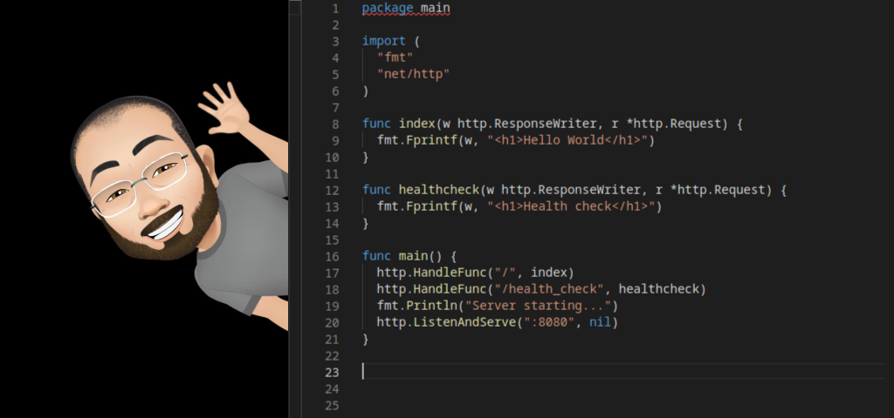

⚡ Currently developing **Hqllr** — a sovereign AI ecosystem for my family’s holding company.

# Hi there, I'm Paul (0x013a-uk)

---

## Why I'm Here
  
What started as private research and experiments over the years, is now being developed **for my family’s holding company** — forming the foundation of **Hqllr**, a new breed of sovereign AI and knowledge ecosystem.  

This is here to:
- To share the vision behind **Hqllr**,  
- To showcase progress transparently,  
- And to connect with collaborators, contributors, and future users.  

---

## Current Projects

### Hqllr — Local. Sovereign. Verifiable.
*A Hall of knowledge. The guardian of truth.*

Hqllr is a family-built knowledge engine and AI ecosystem:
- **Offline-first** — your data stays with you.  
- **Verifiable** — every answer can be traced to its origin.  
- **Persona-adaptive** — responses shaped to your context.  

#### Hqllr Repositories

- [**HqllrMobile - Local AI In Your Pocket**](https://github.com/0x013a-uk/HqllrMobile)  
  *HqllrMobile brings the power of Hqllr Indexer + AI directly to your phone or tablet. Ingest, index, and query — offline, private, and verifiable.*  

- [**Hqllr - Document Indexer**](https://github.com/0x013a-uk/Hqllr)  
  *Atomises documents, removes duplication, and prepares data for instant, verifiable search.*  

- [**HqllrAI - AI ReInvented**](https://github.com/0x013a-uk/HqllrAI)  
  *An adaptive query engine built on Hqllr Indexer: fact-first, persona-aware, provenance-rich answers.*  

- [**HqllrOS - RAM Based Operating System**](https://github.com/0x013a-uk/HqllrOS)  
  *A RAM-orchestrated runtime for Hqllr clusters: simple deployment, replication, and audit-ready federation.*  

- [**HqllrEnterprise - Sovereign AI for Business**](https://github.com/0x013a-uk/HqllrEnterprise)  
  *From personal knowledge engines to enterprise-scale verifiable clusters. Built for compliance, scale, and security.*  

- [**HqllrBenchmarks — Performance Metrics**](https://github.com/0x013a-uk/HqllrBenchmarks)  
  *Performance milestones, throughput metrics, and scaling benchmarks.*  

#### Hqllr Whitepaper
📄 *Coming soon* — the **Hqllr Vision Paper**  
Outlining the challenges of today’s AI landscape and our sovereign-first solution.  

---

## About Me
I’m an IT consultant with **28+ years of experience**, specialising in Linux, server deployments, and cross-platform software development.  

Since 1997, I’ve worked across Linux, Windows, and cloud infrastructures — and today I focus on **sovereign AI and knowledge engines**, with **Hqllr** as the flagship project.  

For years, I maintained privacy with the 0x013a moniker. Now, I’m embracing a public presence to share my work openly, for the benefit of my family and our collective projects.  

---

## Technologies & Tools
- **Languages**: Go, Dart/Flutter, Python, JavaScript, Bash, HTML/CSS  
- **Frameworks**: Flutter, JAMStack, serverless, custom toolkits  
- **Tools**: ArchLinux (daily driver), tmux, GEdit with self-built plugins, VSCode  

---

## My Passions
- **Software Development** — creating tools that simplify tasks and eliminate repetitive work.  
- **Serverless & JAMStack** — building scalable, efficient architectures.  
- **Efficient Code** — optimising performance while minimising resource use.  

---

## Get Involved
- ⭐ Star the Hqllr repos to follow progress  
- 💬 Join discussions in each repo  
- ☕ [Buy me a coffee](https://buymeacoffee.com/0x013a.uk) to support development  

---

## GitHub Stats
  

  

<!--

**0x013a-uk/0x013a-uk** is a ✨ _special_ ✨ repository because its `README.md` (this file) appears on your GitHub profile.

Here are some ideas to get you started:

- 🔭 I’m currently working on ...
- 🌱 I’m currently learning ...
- 👯 I’m looking to collaborate on ...
- 🤔 I’m looking for help with ...
- 💬 Ask me about ...
- 📫 How to reach me: ...
- 😄 Pronouns: ...
- ⚡ Fun fact: ...
-->
